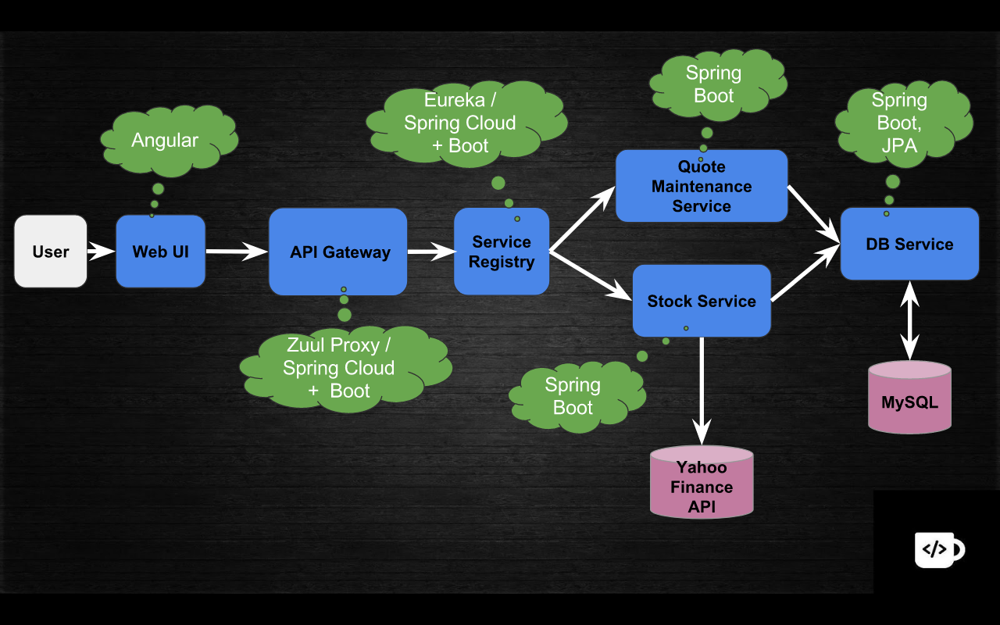

# Stock Viewer Example - Part 1

In this Part, we covered the below microservices:s
- `db-service` - For interactive with MySQL DB
- `stock-service` - For pulling Stock Price from YahooFinance API
- `eureka-service` - Service Registry for registering all microservices

## Architecture Diagram:

